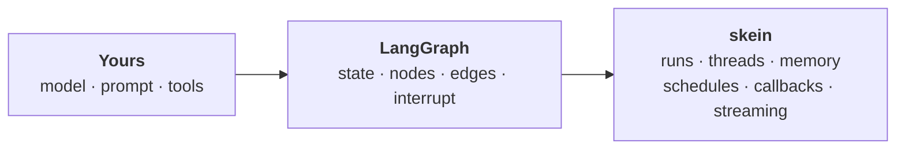
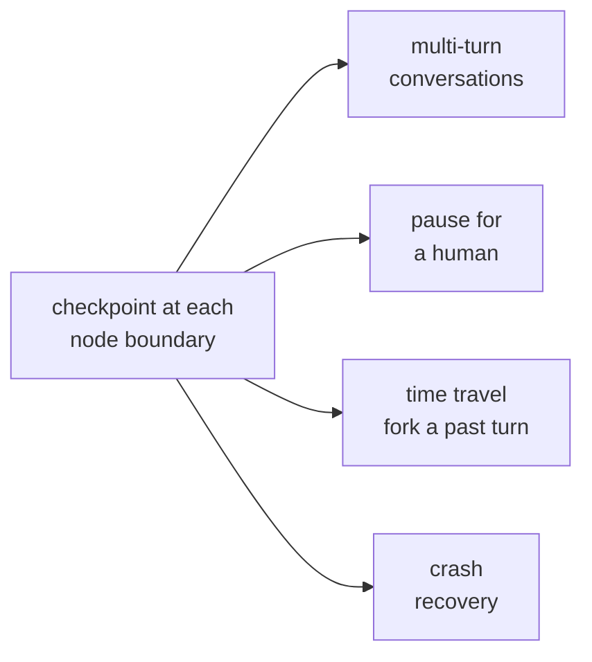

# Building blocks

Every agent starts as a model, a prompt and a loop. That version works for about a day. What follows
is what reality adds — each piece arriving because something broke without it, and each one either
yours to write, LangGraph's to define, or skein's to run.

Read it through once; after that it is a map — find the pressure you are under and follow the link.

## The model and the prompt — yours

skein never sees your model choice. You construct it in your graph, from any LangChain provider, and
your key lives in `.env`.

One habit worth forming early: keep raw data in state and format the prompt inside the node. State is
checkpointed every step, so a rendered prompt in a channel is a copy you pay for on every turn.

→ [Your first agent](./your-first-agent.md#5-give-it-a-real-model)

## Tools — yours

A function plus the metadata the model reads to decide when to call it. That metadata is the model's
_only_ context for the decision, so write it for someone who knows nothing else.

**The trap:** a failing tool does not fail the run. The error goes back to the model, which will
often try again. Bound that in the graph, not in hope.

→ [LangGraph essentials](./langgraph-essentials.md#tools)

## Control flow — LangGraph's

Nodes and edges: what runs, and what runs next. Cycles are expected — an agent loop _is_ a node that
routes back to the model. skein serves whatever you compile and wraps none of it, which is why the
same graph runs on LangGraph Platform.

→ [LangGraph essentials](./langgraph-essentials.md)

## A run is one turn

One input, one execution of your graph. What differs is how you wait: hold the connection, stream, or
take an id and let it work.

Two surprises. A run is not tied to the connection that started it — drop the stream and it keeps
going. And a second message mid-run does not queue: the default strategy is `reject`, which fails the
_second_ run with a 422 and leaves the first alone.

→ [Runs](./runs.md)

## Checkpoints, and everything they buy

This is where homegrown agent servers start hurting, because "the conversation is still there" is not
something a request handler can give you.

LangGraph saves state at every node boundary; skein persists it. One mechanism, four consequences:

> [!WARNING]
> **No checkpointer, none of the above** — and nothing warns you. Runs start empty and resume quietly
> does nothing. `skein dev`, `embedInMemoryGraphs` and `embedPostgresGraphs` all configure one; the
> mistake is constructing your own and handing it to `.compile()`.

A related trap arrives with it. A run carries four bags — `input`, `context`, `config.configurable`,
`metadata` — and only `input` becomes state the agent remembers.

→ [State, context & persistence](./state-and-context.md)

## Threads: one conversation

A thread is the state plus every checkpoint behind it. Address one by a key you already have — a
ticket number, a phone number — and your system needs no mapping table.

→ [Threads](./threads.md)

## Memory: what outlives the conversation

A thread remembers a conversation, not a person. Two stores, two lifetimes:

|                  | Scope                                      | Written by             |
| ---------------- | ------------------------------------------ | ---------------------- |
| **Checkpointer** | One thread                                 | skein, every step      |
| **Store**        | Namespaces you choose, across every thread | Your nodes, explicitly |

**The trap:** a user's name in the thread. They start a new conversation and the agent has forgotten.
Facts about a person go in the store; facts about this conversation stay in state.

→ [Memory](./memory.md) · [Storage](./storage.md)

## Pausing for a human

The moment your agent can spend money or send email, someone will want to be asked first. `interrupt()`
_ends the run_ on a checkpoint — no connection held, no timer, nothing billed while it waits. Approval
comes an hour or a week later and the graph resumes where it stopped.

A pause that cannot survive a redeploy is not worth much, which is why this is the feature that most
often justifies durable storage on its own.

→ [Human-in-the-loop](./human-in-the-loop.md)

## Watching it think

Runs stream over server-sent events, and LangGraph's stream modes map onto the wire unchanged — which
is why `useStream` works against a skein server with a URL change and nothing else. A dropped stream
reconnects and joins the same run.

→ [Streaming](./streaming.md) · [Frontend SDKs](./react-sdk.md)

## Work that outlives the request

Not everything is a chat turn.

- [Background jobs](./background-jobs.md) — hand it over, get an id
- [Crons](./crons.md) — a schedule that fires exactly once across every instance
- [Webhooks](./webhooks.md) — your service told when a run settles

The webhook contract is worth reading twice: delivery is durable, committed in the same transaction
as the run's terminal status, but **at-least-once**. Dedupe on `X-Skein-Delivery-Id` and answer `2xx`
only once your own work is committed.

## Config without a redeploy

An **assistant** is a named, versioned configuration of one graph. Ship a prompt change as a version,
roll it back in one call, graph untouched.

→ [Assistants](./assistants.md)

## Knowing what it did

An agent that works in a demo and misbehaves in production is the normal case. skein emits run and
model-call telemetry through a sink interface, with LangSmith, PostHog and OpenTelemetry
implementations, so traces land in a backend you already run.

What skein does not do is judge the output — that is LangSmith or your own harness. Its job is making
every run recorded and replayable.

→ [Observability](./observability.md) · [Errors & logging](./errors-and-logging.md)

## Where this lives in production

Development is in memory and meant to be. Production is Postgres and Redis, and they buy different
things:

|              | Buys you                                                                               |
| ------------ | -------------------------------------------------------------------------------------- |
| **Postgres** | State, checkpoints, threads, runs, memories and pending webhooks across a restart      |
| **Redis**    | A durable run queue, retry schedules that outlive a deploy, streaming across instances |

Your graph code is identical either way — drivers are injected, not imported.

→ [Storage](./storage.md) · [Runs & Redis](./runs-and-redis.md) · [Deploy](./deploy.md)

## What was yours all along

The model, the prompt and the tools — the reason your agent is _your_ agent. The graph is
LangGraph's. Everything else is plumbing skein exists so you do not write.

Want it as a lookup table instead of a story? [Features](./features.md). Want the graph model itself?
[LangGraph essentials](./langgraph-essentials.md).
