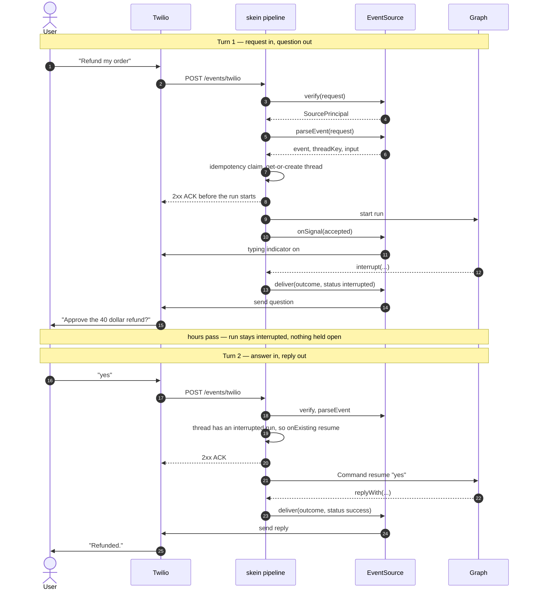

# Proposal — Inbound events: a generic pipeline, capped first-party sources

> **Status:** Draft (revision 2) · **Depends on:** [durable-delivery.md](./durable-delivery.md) and
> [#7](https://github.com/skein-js/skein-js/issues/7) · **Unblocks:** every "agent behind a phone
> number / inbox / webhook" use case
>
> A design proposal, not shipped behaviour. See [proposals/README.md](./README.md).

## Contents

- [Problem](#problem)
- [What we hope to achieve](#what-we-hope-to-achieve)
- [Non-goals](#non-goals)
- [The genericity thesis](#the-genericity-thesis)
- [API surface](#api-surface)
  - [Design rules](#design-rules)
  - [`EventSource`](#eventsource)
  - [`InboundRequest` — and why raw bytes are mandatory](#inboundrequest--and-why-raw-bytes-are-mandatory)
  - [`parseEvent` outcomes](#parseevent-outcomes)
  - [`RunOutcome` — and who decides what the reply is](#runoutcome--and-who-decides-what-the-reply-is)
  - [Interrupts — the async human-in-the-loop path](#interrupts--the-async-human-in-the-loop-path)
  - [Run signals — typing, status, progress](#run-signals--typing-status-progress)
  - [Stability commitments](#stability-commitments)
- [Authentication and authorization](#authentication-and-authorization)
- [The pipeline](#the-pipeline)
- [Packaging and distribution](#packaging-and-distribution)
- [Configuration — `skein.events`, not a new file](#configuration--skeinevents-not-a-new-file)
  - [Which graph runs an event](#which-graph-runs-an-event)
- [Validation against real providers](#validation-against-real-providers)
- [Alternatives considered](#alternatives-considered)
- [Risks and open questions](#risks-and-open-questions)
- [Success criteria](#success-criteria)
- [Phasing](#phasing)

## Problem

Suppose you run a skein server and want a WhatsApp number that talks to your agent. Twilio POSTs
you an inbound message; you want the agent's reply sent back to that number.

With [#7](https://github.com/skein-js/skein-js/issues/7) and
[durable-delivery.md](./durable-delivery.md) shipped, this is finally _correct_ to build. It is
still not _small_ to build. You write, by hand:

1. A route that verifies Twilio's `X-Twilio-Signature`.
2. A dedup check on Twilio's `MessageSid`, because retried deliveries happen.
3. A mapping from `whatsapp:+254…` to a thread, created if absent.
4. A branch on thread status — if a run is `interrupted` waiting for a human, this message must
   **resume** it with a `Command`, not start a new run. Get this wrong and human-in-the-loop over an
   async channel silently doesn't work.
5. A mapping from Twilio's form-encoded body to your graph's input shape.
6. A callback receiver that turns the run's final state into a Twilio API call, without
   double-sending on retry.

And if the agent takes twenty seconds to answer, the user stares at a dead chat window — so you also
wire up a typing indicator and keep it alive, which means subscribing to run progress from a
completely different part of the system.

Steps 1–4 and 6 are **identical for every provider anyone will ever integrate**. Only step 5, and
the specific recipe inside step 1, are actually about Twilio. Yet today all of it is the user's
problem, re-solved per integration, with the interesting failures (double-reply, lost reply, a HITL
interrupt that never resumes) landing in front of end users rather than in a test.

## What we hope to achieve

- **G1 — One integration ≈ one small file.** Tens of lines of glue, not hundreds of lines of
  plumbing.
- **G2 — The hard parts are ours, once.** Dedup, thread resolution, resume-vs-start, durable reply
  delivery, run progress, and signature-verification primitives live in skein, tested, and every
  integration inherits them.
- **G3 — Generic across integration _kinds_, not just chat providers.** The same mechanism serves a
  GitHub webhook, an inbound email, and a Stripe event as naturally as WhatsApp.
- **G4 — A real plugin surface, with a small blessed set.** Anyone can write a source without a PR
  to this repo; skein ships a capped handful so the common cases work out of the box.
- **G5 — Entirely optional.** A user who never configures it should not be able to tell the feature
  exists.

The positioning: LangGraph gives you an agent behind an API. This gives you an agent behind **any
inbound event**.

## Non-goals

- **❌ An _unbounded_ set of first-party sources.** Three, capped, with a written demotion path —
  see [Packaging and distribution](#packaging-and-distribution). skein already ships vendor
  integrations for telemetry (`@skein-js/langsmith`, `posthog`, `otel`), so "we never integrate with
  anyone" was never the real rule. The real rule is that the set is **bounded and the interface is
  public**.
- **❌ A declarative no-code mapping language** (JSON pointers, signature recipes in config).
  Deliberately deferred — see [Alternatives](#alternatives-considered).
- **❌ Outbound-initiated conversations** (broadcast, drip campaigns). This is an _inbound_
  pipeline.
- **❌ Polled sources (IMAP/POP mailboxes, queue consumers).** The pipeline is entered by an inbound
  HTTP request; there is nothing to enter it with when you poll. A poller is a different mechanism,
  closer to the cron scheduler. Webhook-delivered email is in scope; IMAP is not.
- **❌ Chunked streaming of the _answer itself_ in v1.** Ephemeral progress signalling (typing,
  status) is in scope; incrementally sending the answer is a scoped follow-up with an unsolved
  duplicate-on-crash problem — see [Run signals](#run-signals--typing-status-progress).
- **❌ Media/attachment storage.** skein has no blob story and this does not create one; sources
  carry the provider's URL in metadata and the graph fetches it.
- **❌ New storage.** See the architectural test below.

## The genericity thesis

Every inbound integration — chat, webhook, email, IoT — is the same pipeline. Only one step is
genuinely provider-specific:

| Step                                    | Provider-specific?                                           |
| --------------------------------------- | ------------------------------------------------------------ |
| 1. Verify the request is authentic      | The **recipe** varies; the primitives don't                  |
| 2. Deduplicate the provider's retries   | No — only _where_ the event id lives varies                  |
| 3. Resolve a stable key to a thread     | No                                                           |
| 4. Start / resume / enqueue / ignore    | No — this is **policy**, and it's the same policy everywhere |
| 5. Map payload ↔ graph input and output | **Yes.** This is the integration.                            |
| 6. Signal progress while the run works  | No — a projection of the existing run event bus              |
| 7. Deliver the reply, durably           | No — [durable-delivery.md](./durable-delivery.md) owns it    |

**skein ships everything but step 5 (and the recipe for step 1) as mechanism.**

**The second half of the thesis: model events, not chat messages.** If the canonical type is an
_event_ rather than a _message_, the identical pipeline covers a GitHub `issues.opened` → triage
agent → comment back, a Stripe dispute → agent drafts a response, an inbound email → agent replies.
Chat is simply the case where the reply target equals the sender.

This is the answer to _"generic enough for the majority of integrations?"_ — **yes, but only if we
resist chat-specific concepts** (`from`, `to`, `body`, typing indicators as first-class fields). The
moment those appear in the core types, GitHub and Stripe stop fitting. Note that typing indicators
are supported here _without_ a `typing` concept in the core API: skein emits generic progress
signals, and a chat source decides those mean "typing" while a GitHub source ignores them entirely.

## API surface

This interface becomes public the moment it is advertised, and third-party packages will depend on
it. It is the most expensive thing here to change later, so the reasoning is written down rather
than implied.

### Design rules

1. **Every provider-specific decision is a source's, every correctness-critical decision is ours.**
   A source cannot opt out of dedup, ordering, or durable delivery — those are the value.
2. **Verb-first names, no abbreviations**, per [AGENTS.md](../../AGENTS.md). Hence `parseEvent`, not
   `toEvent`; `idempotencyKey`, not `dedupeKey` — the latter also names the mechanism it feeds.
3. **Additive-only evolution.** Every variant type is a discriminated union so a new outcome is a
   new arm, not a signature change. Optional fields may be added; required fields may not.
4. **Reliability regimes are syntactic, not documentary.** Durable delivery and best-effort
   signalling are separate methods, so a source cannot accidentally put the answer on the lossy path.
5. **No privileged access.** First-party sources import only the public entry point, exactly like a
   community source. If `@skein-js/events-twilio` needs an internal, the internal is missing from the
   public API — fix that instead.

### `EventSource`

```ts
export interface EventSource {
  readonly name: string;

  /**
   * Authenticate the request. Returns the principal it represents, or `false` to reject (401).
   * REQUIRED — see Authentication. Runs before any parsing, over the raw bytes.
   */
  verify(request: InboundRequest): Promise<SourcePrincipal | false>;

  /** Map a verified request to an event, an ignore, or a direct response. The integration. */
  parseEvent(request: InboundRequest): Promise<EventOutcome> | EventOutcome;

  /**
   * Deliver the answer. DURABLE — routed through the delivery outbox, retried, recorded.
   * Omit to fall back to a plain webhook target.
   */
  deliver?(outcome: RunOutcome, target: ReplyTarget): Promise<void>;

  /** Which run signals this source wants, if any. Omit to receive none and pay nothing. */
  readonly signals?: SignalSubscription;

  /**
   * React to run progress — typing indicators, status messages, "still working".
   * BEST-EFFORT: at most once, never retried, never blocks the run. Must not send the answer.
   */
  onSignal?(signal: RunSignal, target: ReplyTarget): Promise<void>;
}

export interface InboundEvent {
  /** Stable external identity → a deterministic thread. `whatsapp:+254…`, `gh:owner/repo#41`. */
  threadKey: string;
  /** Graph input, or a `Command` when resuming. */
  input: unknown;
  /** The provider's own event id. Becomes the `Idempotency-Key` for the run it creates. */
  idempotencyKey?: string;
  /** Where the answer goes. Opaque to skein; handed back to `deliver` and `onSignal`. */
  replyTo?: ReplyTarget;
  /**
   * Optional routing among graphs the deployment opted into via `allowed_assistants`. Omit — the
   * common case — and the source's configured `assistant` runs. See "Which graph runs an event".
   */
  assistantId?: string;
  metadata?: Record<string, unknown>;
  /** Policy when the thread already has an active or interrupted run. Default: `"resume"`. */
  onExisting?: "resume" | "enqueue" | "interrupt" | "reject";
}
```

`onExisting: "resume"` as the **default** is step 4 from the problem statement — the one everybody
gets wrong. An event arriving at a thread whose run is `interrupted` should resume that interrupt,
because a human-in-the-loop pause on an async channel is exactly what a reply hours later is
answering. Making the correct behaviour the default is most of this proposal's practical value.

### `InboundRequest` — and why raw bytes are mandatory

```ts
export interface InboundRequest {
  readonly method: string;
  /** The **public** URL, honouring `X-Forwarded-Proto`/`Host`. See below. */
  readonly url: URL;
  readonly headers: Readonly<Record<string, string>>;
  /** Unparsed body. The signature is computed over these bytes; parsing first destroys it. */
  readonly rawBody: Uint8Array;
  /** Lazy, cached views over `rawBody`. */
  json(): unknown;
  form(): Record<string, string>;
  text(): string;
}
```

Two fields carry security weight and neither is negotiable:

- **`rawBody`.** Slack signs `v0:{timestamp}:{raw body}`; Mailgun signs timestamp+token. If a
  transport adapter parses JSON before `verify` runs, signature checking becomes _impossible_ and
  the only remaining option is to trust the request. Preserving raw bytes across Express, Fastify,
  NestJS, Next.js and Fetch is **security-critical per-adapter work**, not a convenience — and the
  largest under-costed item in revision 1 of this proposal.
- **`url` must be the public URL.** Twilio signs HMAC-SHA1 over the full request URL plus sorted POST
  params. Behind a proxy or load balancer the URL skein observes is not the one Twilio signed, so
  verification fails silently unless forwarding headers are honoured or the public base URL is
  configured explicitly.

### `parseEvent` outcomes

```ts
export type EventOutcome =
  | { kind: "event"; event: InboundEvent }
  /** Acknowledge and do nothing — 204. Bot echoes, delivery receipts, uninteresting event types. */
  | { kind: "ignore" }
  /** Answer synchronously without starting a run. */
  | { kind: "respond"; status: number; headers?: Record<string, string>; body?: unknown };
```

A tagged union rather than `InboundEvent | null`, for two reasons:

- **`ignore` must be free and first-class.** Providers send enormous volumes of noise. Slack
  redelivers your own bot's messages as events — without cheap filtering on `bot_id`, the agent
  replies to itself in a loop.
- **`respond` is required by three real providers.** Slack's very first request is a
  `url_verification` challenge that must echo `{"challenge": "…"}` in the body; Slack slash commands
  want an immediate ephemeral response; Twilio TwiML is the same shape. A 204 cannot express any of
  them. Revision 1 had no escape hatch here and would have failed on Slack setup, step one.

### `RunOutcome` — and who decides what the reply is

`parseEvent` maps the provider's payload **in**. Something has to map the answer back **out**, and
that direction has a coupling problem the inbound direction does not.

**Neither party knows enough on its own.** The source owns provider knowledge — how to call Twilio.
The **graph** owns state shape — whether the answer lives at `state.messages.at(-1).content`, or
`state.answer`, or `state.draft`. A source that guesses at state shape stops being reusable across
graphs, which quietly breaks the plugin premise the whole proposal rests on. This is the same
coupling carefully avoided on the inbound side, reappearing on the outbound one.

**So the graph declares its reply; the source never guesses.** LangGraph already has the channel for
this — `StreamWriter` / `stream_mode: "custom"`, the same mechanism behind `RunSignal.custom`:

```ts
// inside a node — one reserved key, typed by a helper skein exports
writer(replyWith("Your order ships Tuesday."));
```

Every source consumes that one shape regardless of state shape. Source stays graph-agnostic, graph
stays source-agnostic, and no per-deployment mapping config is needed.

```ts
export interface RunOutcome {
  runId: string;
  threadId: string;
  status: RunStatus;
  /** What the source should send, resolved by the order below. Absent means "say nothing". */
  reply?: DeclaredReply;
  /** Terminal graph state, for sources that need more than `reply`. */
  values: unknown;
  /** Present when `status === "interrupted"` — the question posed to the human. */
  interrupt?: unknown;
  /** Present when `status === "error"`. Diagnostic; not for end users. */
  error?: { message: string };
}

export interface DeclaredReply {
  text: string;
  attachments?: readonly { url: string; mimeType?: string }[];
  metadata?: Record<string, unknown>;
}
```

**Resolution order**, applied by the pipeline before `deliver` is called:

1. The graph declared a reply on the custom channel → use it.
2. Otherwise, state carries a `messages` array → the last AI message's content. This is LangGraph's
   `MessagesAnnotation` convention, so ordinary chat agents work with **no graph changes at all**.
3. Otherwise → `reply` is absent, and the source sends nothing.

Making step 2 a fallback rather than the contract is the whole point: the common case costs nothing,
and a graph with custom state has an escape hatch that does not involve the source knowing anything
about it.

**Non-success outcomes are where this earns its keep:**

- **`interrupted` must still deliver**, and its question is resolved into `reply` like any other —
  see [Interrupts](#interrupts--the-async-human-in-the-loop-path). A source never branches on
  status to render text.
- **`error` deliberately carries no reply.** Whether an end user is told "something went wrong" is a
  product decision, and leaking internals to a phone number is the wrong default. The source gets
  `status` and `error` and decides.
- **`cancelled`** sends nothing.

**One reply per run, last write wins.** A graph that writes the reply channel twice gets the last
value, not two messages. Delivering N messages durably is precisely the chunked-streaming problem
already deferred in [Run signals](#run-signals--typing-status-progress) — a multi-message turn is the
same feature under a different name, and it should be solved once, later, rather than half-solved
here.

### Interrupts — the async human-in-the-loop path

An agent that can pause and ask a human a question, over a channel the human answers hours later, is
the capability this proposal most uniquely enables. It is also the only place the graph↔source
boundary is crossed **twice** — once rendering the question, once interpreting the answer — so it
gets the declaration discipline in both directions rather than a guess in either.

The full round trip, with both crossings and the gap in the middle:



Three things the diagram makes concrete that prose does not. The **ACK precedes the run** in both
turns, so no provider timeout depends on how long the agent thinks. The **gap costs nothing** — an
interrupted run holds no connection, no subscription and no timer, only a checkpoint. And **turn 2
is the same path as turn 1** right up to the resume decision, which is why a source needs no notion
of "this is a follow-up".

**Outbound: rendering the question.** The graph calls `interrupt({ … })` with a payload only it
understands. Rather than a second mechanism, this extends the same resolution order:

1. The graph declared text via `replyWith` — it works inside an interrupt payload like anywhere else.
2. Otherwise, the interrupt payload carries a `text` or `question` string → use it.
3. Otherwise → nothing to send, **and log a warning**.

Step 3 deliberately differs from the success case. A successful run that renders no reply is fine —
maybe the graph had nothing to say. An **interrupt** that renders no reply strands the conversation
permanently: the run waits for an answer to a question nobody was asked. Silence there is always a
bug, so it should be noisy.

**Inbound: interpreting the answer.** The next event on that thread resumes the run with
`Command({ resume })`. The value passed is **the same `input` the source would have produced for a
new turn** — no parsing, no coercion.

This is deliberate. The graph author wrote `interrupt()` and is the only party who knows whether the
node wants `true`, `"approve"`, or free text. Any interpretation by skein or by a provider-specific
source would be a guess about a graph it has never seen — the same coupling avoided everywhere else
in this design.

**When the answer isn't an answer.** A user may reply "actually, never mind — what's my balance?"
That is not an answer to the pending question, and no amount of source-side cleverness can reliably
tell. So the pipeline still resumes, and the **graph** decides whether to re-ask, pivot, or abandon —
because the graph is the only party holding the question. Deployments that want a blunter rule keep
`onExisting` (`"enqueue"` starts fresh instead).

**Staleness.** A thread interrupted three weeks ago probably should not resume because someone texted
today. A `resume_within` bound would fall back to `onExisting: "enqueue"` past its window. Default
value is **open**, and it is genuinely product-specific: silently discarding a pending
human-in-the-loop turn is worse than an odd resume, so the lean is no expiry unless configured.

**Multiple pending interrupts.** LangGraph can surface more than one, and a single inbound message
cannot unambiguously answer N questions. v1 resumes the first and logs; whether ambiguity should
instead reject is **open**.

### Run signals — typing, status, progress

A twenty-second agent turn behind a dead chat window is a bad product. Chat providers all offer some
affordance — Twilio and Telegram typing indicators, Slack's `chat.update` on a placeholder message —
and they all need the same thing from skein: **a subscription to run progress**.

```ts
export type RunSignal =
  /** The run was accepted and queued. Turn the typing indicator on. */
  | { kind: "accepted"; runId: string }
  /** The graph advanced. `node` names the step; `custom` carries a graph-emitted status payload. */
  | { kind: "progress"; runId: string; node?: string; custom?: unknown }
  /** Periodic tick while the run is still active — for indicators that expire and need refreshing. */
  | { kind: "keepalive"; runId: string }
  /** The run paused for a human. Usually: send the question, turn the indicator off. */
  | { kind: "interrupted"; runId: string; interrupt: unknown }
  /** Terminal. `deliver` handles the answer; this is for cleanup (indicator off). */
  | { kind: "settled"; runId: string; status: RunStatus };

export interface SignalSubscription {
  kinds: readonly RunSignal["kind"][];
  /** Interval for `keepalive`, in ms. Telegram-style indicators expire in seconds. */
  keepaliveMs?: number;
}
```

**This is a projection, not new machinery.** skein already fans a run's output out to readers over
[`RunEventBus`](../../packages/core/src/queue/queue.ts) — cross-instance capable via Redis pub/sub —
already drives `stream_mode: "events"` through LangGraph's `streamEvents` v2, and already emits
periodic SSE heartbeat comments in idle gaps. `RunSignal` is a coarse, stable projection of that
bus; it does not add storage, and it preserves the architectural test below.

**Why a declared `signals` subscription rather than always-on.** Fine-grained modes are expensive —
`events` mode carries full token granularity. A source that only wants "keep the typing indicator
alive" should not pay for token streaming, and a GitHub source should pay nothing at all. Declaring
the subscription lets the pipeline pick the cheapest stream mode that satisfies it, and omitting
`signals` means no subscription is opened.

**The reliability boundary is the important part.** `deliver` and `onSignal` are separate methods
precisely because they have opposite guarantees:

|                | `deliver`                                 | `onSignal`                               |
| -------------- | ----------------------------------------- | ---------------------------------------- |
| Carries        | The answer                                | Ephemeral UX affordances                 |
| Guarantee      | Durable, at-least-once, retried, recorded | Best-effort, at-most-once, never retried |
| On crash       | Replayed from the outbox                  | Lost, by design                          |
| Failure impact | Alarming — a user never gets their reply  | Cosmetic — a typing dot doesn't appear   |

Retrying a "typing" signal four minutes later is nonsense; making the answer best-effort defeats the
entire proposal. Two methods make that distinction impossible to get wrong, where one method plus a
documentation note would not. `onSignal` failures are logged and swallowed, and can never fail or
slow a run — the same contract telemetry sinks already have.

**Why chunked streaming of the answer is explicitly out of v1.** It sits astride that boundary and
breaks it: send the answer in pieces as they're produced, crash halfway, and the outbox replays a
message the user already partly received. Solving it needs either provider-side message editing
(Slack can, WhatsApp cannot) or a resumable delivery cursor. Both are real designs; neither is this
one. The follow-up must state which half of the boundary it lives on before it is built.

### Stability commitments

Stated now, because "we'll figure out compatibility later" is how plugin ecosystems die.

**Frozen at 1.0** — changing these is a major version of `@skein-js/events`:

- The `EventSource` method names and signatures.
- `InboundEvent.threadKey` and `.input` as the required pair.
- `EventOutcome` and `RunSignal` as `kind`-discriminated unions (new arms are additive and safe).
- `InboundRequest.rawBody` and `.url` semantics.
- The `deliver` / `onSignal` reliability split.
- The reply-resolution order (declared → `messages` convention → nothing), and that an `interrupted`
  run still delivers. Sources are written against both.
- That a source can only reach graphs the deployment listed in `allowed_assistants`. This is a
  security boundary, not a convenience — widening it silently would let an installed package route
  untrusted input into any graph.

**Explicitly provisional** — may change in a minor, and documented as such so nobody builds on them:

- The `onExisting` value set (more policies are likely).
- `ReplyTarget`'s shape; today it is opaque and only round-trips through `deliver` and `onSignal`.
- `RunSignal.custom`'s payload contract.
- `DeclaredReply`'s non-`text` fields — `attachments` depends on the deferred blob story.
- Anything about batching (see [Risks](#risks-and-open-questions)).

**Versioning approach:** plain semver on `@skein-js/events`, with sources declaring a peer
dependency. No bespoke version-negotiation protocol — that is a lot of machinery for a problem we do
not have yet, and it can be added compatibly later if the ecosystem grows enough to need it.

## Authentication and authorization

The riskiest question in revision 1, and it now has a concrete answer.

**The trap.** Twilio presents `X-Twilio-Signature`, not a bearer token.
[`resolveAuthContext`](../../packages/agent-protocol/src/auth/authenticate-request.ts) invokes the
user's `authenticate` handler, which expects a JWT or API key, and will **401 every inbound
webhook**. The obvious workaround — exempting these routes the way `getServerInfo` is exempted in
[`createAuthorizingHandlers`](../../packages/agent-protocol/src/auth/authorizing-handlers.ts) — is
far worse. That exemption is justified because `/info` exposes no thread, run, or store content.
Event routes **create runs**. An exempt route is an unauthenticated run-creation endpoint that
bypasses the entire `Auth` block.

**The fix: `verify()` returns a principal, not a boolean.**

```ts
export interface SourcePrincipal {
  /** e.g. `"source:twilio:+254712345678"` — derived from provider-verified data only. */
  identity: string;
  permissions?: string[];
  metadata?: Record<string, unknown>;
}
```

The provider's signature _is_ an authentication scheme; it simply is not a bearer token. Having it
produce an `AuthUser` lets the request flow through the **normal** authorization path with a real
principal — `@auth.on.threads` handlers see it, ownership filters apply, and multi-tenancy works
because the identity derives from the provider-verified sender, the only trustworthy identity in the
request. **No bypass anywhere.**

**Consequences that follow from this, all load-bearing:**

- **`verify` is required, not optional.** Revision 1 made it optional, reasoning that SendGrid
  Inbound Parse ships no signature scheme. That was wrong: optional verification on a run-creating
  endpoint is precisely the hole above. A provider with no signature must still yield a principal
  some other way — secret path segment, shared-secret query parameter, basic auth. Weaker, never
  absent.
- **The Studio bypass must not apply.** `resolveAuthContext` admits `x-auth-scheme: langsmith`
  without authenticating. On an event route that is one forged header away from free run creation.
  Event routes authenticate **only** through `verify()`.
- **Authorization reuses the crons precedent exactly.** The `fallbackResource` reasoning in
  [`route-authz.ts`](../../packages/agent-protocol/src/auth/route-authz.ts) — that crons scope to
  `threads` because "a schedule creates runs on a thread, so an unscoped cron resource would let any
  authenticated caller enumerate every tenant's schedules" — describes an event source precisely. It
  authorizes as `{ resource: "threads", action: "create_run" }`, as every run route already does.
- **The route stays inside the handler table.** `ROUTE_AUTHZ` is
  `Record<keyof ProtocolHandlers, RouteAuthz>` — **exhaustive by type**, so adding the handler will
  not compile until someone makes an explicit auth decision. Mounting event routes outside the table
  would forfeit that guarantee.

## The pipeline

**Architectural test:** the pipeline must be a **pure composition of primitives that already exist**
after #7 and durable-delivery. **If it needs storage of its own, that is a signal durable-delivery is
incomplete** and the gap belongs there, not here.

```
POST /events/:source
  → verify()                    → principal, or 401
  → parseEvent()                → ignore? 204 · respond? that response · else continue
  → idempotencyKey              → replay prior response      [durable-delivery Part 1]
  → resolve threadKey           → get-or-create thread        [#7: if_exists / if_not_exists]
  → resolve assistant           → event's, if allowed; else the source's configured one
  → resume | start | enqueue    → per onExisting
  → enqueue run, ACK 2xx        ← invariant, see below
  ├→ onSignal(…)                → best-effort, from RunEventBus   [existing machinery]
  └→ deliver(outcome, replyTo)  → durable, retried, recorded  [durable-delivery Part 2]
```

**Invariant: acknowledge after enqueueing, never after the run completes.** Slack requires a 2xx
within 3 seconds or it retries and shows the user an error; Twilio times out comparably. Background
runs already give us this, but it must be pinned by a test rather than left incidental. Note this is
also _why_ run signals are needed at all — the ack is early, so progress has to arrive out of band.

Registered in [`skeinRoutes`](../../packages/agent-protocol/src/http/routes.ts) with a new
`RouteGroup: "events"`, so `http.disable_events` works like every other group — and the route is
**absent from the table entirely** unless a source is configured, which is stronger than
disable-able.

## Packaging and distribution

Three tiers, mirroring how telemetry already works in this repo:

1. **`@skein-js/events`** — pipeline, interface, vendor-neutral crypto helpers (constant-time
   compare, replay windows, signature-header parsing, multipart/form decoding). These are the parts
   people genuinely get wrong; a naive `===` on a signature is a timing oracle.
2. **First-party sources** — `@skein-js/events-twilio`, naming that mirrors `telemetry-langsmith`
   exactly. **Capped at three, written down**: a fourth requires dropping one or an explicit
   decision. "A few" without a number becomes twenty.
3. **Community sources** — own repos, `skein-source-*` npm convention, a docs page listing known
   ones. Adding a provider requires **no skein release and no PR here** — the real test of whether
   the interface is good.

**Which three**, chosen to stress different seams rather than by popularity:

| Source          | What it proves                                                                           |
| --------------- | ---------------------------------------------------------------------------------------- |
| Twilio WhatsApp | URL-based HMAC-SHA1, form encoding, expiring typing indicators, the motivating case      |
| Slack           | Raw-body signature, the `respond` escape hatch, bot-echo filtering, the 3-second ack     |
| Webhook email   | Native `In-Reply-To` threading, weak-authentication fallback, non-chat shape, no signals |

GitHub webhooks stays in the **example** tier as the non-chat proof.

**Bounding the liability.** A first-party source over ~100 lines means the core is missing
something — fix the core. **No vendor SDKs**: they are the actual liability (breaking changes,
transitive dependencies, install weight), and raw HTTP against the documented scheme is enough.
Twilio inbound is form-encoded plus an HMAC; outbound is one POST. A written demotion path moves a
first-party source to community ownership if it becomes a burden, extending the existing
alias-plus-`@deprecated` convention.

**The security posture change is real and worth stating plainly:** shipping a first-party source
makes skein responsible for the correctness of _someone else's_ signature scheme. A flaw there is a
CVE in skein rather than in user code. That is the argument for the cap, and for an adversarial
conformance suite — mirroring the `SkeinStore` conformance suite already in `@skein-js/test-support`,
so a community source can prove it rejects forged signatures, stale timestamps, duplicate event ids
and bot echoes without anyone reviewing it by hand.

## Configuration — `skein.events`, not a new file

**Decision: no `skein.json`.** skein already reserves a namespace inside `langgraph.json`
([`langgraph-json.ts`](../../packages/config/src/langgraph-json.ts): _"Skein production settings.
Unknown keys remain forward-compatible."_), and `path:export` loading is proven three times over —
graphs, `auth.path`, and telemetry `paths`. New surfaces go under `skein.*` from day one:

```jsonc
{
  "graphs": {
    "support": "./src/support.ts:graph",
    "triage": "./src/triage.ts:graph",
  },
  "skein": {
    "events": {
      // A source binds a provider to a graph. Both keys are required.
      "twilio": {
        "path": "@skein-js/events-twilio", // first-party package
        "assistant": "support", // which graph its events run
      },
      "github": {
        "path": "./src/github-source.ts:source", // your own, path:export
        "assistant": "triage",
        "allowed_assistants": ["triage", "support"], // opt in to source-side routing
      },
    },
  },
}
```

A separate `skein.json` would solve the forward-collision problem that the reserved namespace
already solves, at the cost of a second file, a second loader, merge semantics, and a permanent
"which file does this go in?" question. The namespace wins.

### Which graph runs an event

A registered source with no graph has nothing to run, and `InboundEvent.assistantId` alone cannot
answer it: **the binding is deployment knowledge, not provider knowledge.** A community Twilio
adapter has no business knowing you named your graph `support`. So the binding is declared where the
source is registered, and `assistant` is **required** — a source without one is a boot-time
configuration error, not a 500 on the first real message.

`assistant` accepts a **UUID or a graph name**, resolving exactly as it does for crons
([crons.md](../crons.md)) — a graph name resolves to the assistant skein auto-registers for it. Same
notation, same resolver, nothing new to learn.

**Resolution order** per event:

1. `InboundEvent.assistantId`, when the source returned one **and** it appears in
   `allowed_assistants`.
2. Otherwise the source's configured `assistant`.

Source-side routing exists because real integrations need it — one Slack app serving `#support` and
`#eng` from different graphs, or a GitHub source sending `issues.opened` to triage and
`pull_request` to review. But it is **opt-in and bounded**: a source may only reach graphs the
deployment listed in `allowed_assistants`, and an unlisted `assistantId` is rejected and logged
rather than honoured.

That bound is the point. A source is an npm package you installed; without it, any published source
could route arbitrary untrusted input into any graph in the deployment. Omitting
`allowed_assistants` means the source cannot route at all, which is the right default for the
majority of integrations that only ever need one graph.

**Validated at boot, not at first event.** A missing `assistant`, an `assistant` naming a graph that
does not exist, or an `allowed_assistants` entry that does not resolve should all fail startup with a
precise `SkeinConfigError` — the same discipline `loadAuthEngine` already applies to a bad `auth.path`.
Discovering a typo when the first customer texts is the failure this is designed to avoid.

**But the namespace is not being used consistently today, and that _is_ a live risk.** Two
skein-only surfaces sit outside it: top-level **`telemetry`** (self-described as "a skein extension —
the LangGraph CLI has no equivalent") and **`store.index.hnsw`**, nested inside a LangGraph-owned
block. If LangGraph ever adds a `telemetry` key — entirely plausible, given LangSmith — skein has a
genuine conflict with no good resolution. Worth a separate issue to alias them under `skein.*` using
the established alias-plus-`@deprecated` convention. Not part of this proposal, but the reason to
get `events` right the first time.

## Validation against real providers

Checked against the three intended first-party sources:

- **Twilio** — clean fit. `MessageSid` as `idempotencyKey`, `threadKey` from `From` (or `From:To`
  when several agent numbers share a deployment), reply via the REST API from `deliver`. Typing
  indicators expire, so it subscribes to `keepalive`. Only friction is the public-URL requirement.
- **Slack** — fits, and forced three API amendments across revisions (`respond`, `rawBody`,
  signals). `event_id` is a clean idempotency key; `X-Slack-Retry-Num` confirms retries are real and
  aggressive; bot-echo filtering via `ignore` is what stops an infinite self-reply loop. Its
  `chat.update` capability is also the strongest argument that chunked answer streaming will
  eventually be worth designing — for the providers that can edit a message in place.
- **Webhook email** — fits well, and usefully declares **no** `signals` at all, which is the proof
  that progress signalling is genuinely optional rather than assumed. `Message-ID` is an
  RFC-guaranteed idempotency key, and `In-Reply-To`/`References` give real native threading, so
  `threadKey` maps to an actual mail thread rather than just a sender address. Attachments are the
  weakest spot and are scoped out.
- **IMAP/POP** — does **not** fit, and is now an explicit non-goal.

Provider specifics above should be reconfirmed against current vendor documentation at
implementation time; the structural conclusions do not depend on the details.

## Alternatives considered

**1. Ship nothing beyond durable-delivery.** Users write ingress in their own app — and often
already have one, since skein mounts into Express/Fastify/Nest/Next. This is the honest baseline and
stronger than it first looks: durable-delivery alone makes every integration possible and correct,
with zero new concepts and zero maintenance.

Rejected conditionally. It does not give anyone step 4 (resume-vs-start), progress signalling, or any
guarantee that dedup and thread-keying were done right — subtle, with silent user-facing failures.
**If the Twilio example in phase 1 comes out short without a pipeline, this alternative wins and we
take it.**

**2. Declarative sources in config** — JSON pointers for the event id and text, a named HMAC recipe,
a reply template. Genuinely attractive: the simple majority of providers would need no code.
Deferred, not rejected — config languages reliably grow into bad programming languages, and we would
be guessing at the common shape. Revisit once several code-based sources exist and the shared
structure is **empirical**. The Slack `respond` case and the signals subscription are good early
warnings of what a config language would have to grow.

**3. A separate `skein.json`.** See [Configuration](#configuration--skeinevents-not-a-new-file).

**4. One `deliver` handling both the answer and progress.** Simpler surface, one method, and a
source could just switch on the signal kind. Rejected: it puts two opposite reliability guarantees
behind one signature, and the failure mode is a source accidentally sending the answer on the lossy
path — invisible in testing, catastrophic in production. See
[the boundary table](#run-signals--typing-status-progress).

**5. Unbounded first-party sources.** Rejected — unbounded maintenance against third-party APIs plus
an unbounded security surface.

**6. Chat-first types** (`from`/`to`/`body`, a `typing` primitive). Rejected: marginally nicer for
WhatsApp, fatal for GitHub, Stripe and email. Generic progress signals give chat sources typing
indicators without imposing the concept on anyone else.

## Risks and open questions

- **`threadKey` → thread id.** Verbatim, or hashed? Verbatim is debuggable (`whatsapp:+254…` is
  self-describing in logs); hashing avoids putting a phone number in a primary key, which carries
  real privacy and GDPR weight. **Leaning hashed, with the raw key in thread metadata.** Depends on
  #7. **Open.**
- **Raw-body preservation across five transports** is the biggest implementation cost and a
  correctness requirement. Next.js App Router and NestJS are the ones to prototype first.
- **Signal fan-out cost at scale.** Every active run with a subscribed source holds a bus
  subscription and, with `keepalive`, a timer. Thousands of concurrent conversations is a different
  load profile from thousands of API runs. Needs a bounded-subscription story before Slack ships.
  **Open.**
- **Which stream mode satisfies which subscription.** `progress` could ride `updates` (cheap) or
  `events` (expensive but richer). The mapping should be chosen by the pipeline, not the source, and
  it is not yet pinned. **Open.**
- **Chunked answer streaming** — deferred, with the duplicate-on-crash problem named above. Slack's
  `chat.update` suggests the eventual design is provider-capability-dependent.
- **Batching.** Mostly resolved: Twilio, Slack and Inbound Parse all send one event per POST. Some
  providers do batch (SendGrid's _Event_ webhook sends arrays), but that is an adapter-side loop, not
  a core concern. Lower risk than revision 1 assumed — and the reason batching stays provisional.
- **Attachments.** Out of scope for v1; will be the first thing anyone asks for.
- **Interface churn.** The contract becomes public API when advertised, which is why phase 4 lands a
  second, non-chat source _before_ it is called stable.

## Success criteria

1. A working Twilio WhatsApp integration — verify, dedup, thread mapping, HITL resume, typing
   indicator, durable reply — in **under 60 lines** of user code, written **entirely outside this
   repo**.
2. A **GitHub webhook** integration on the identical interface, using no chat-specific concept and
   subscribing to no signals. The real test of [the thesis](#the-genericity-thesis); if it needs
   special-casing, the abstraction is message-shaped and wrong.
3. **Zero vendor SDKs** in skein's dependency tree.
4. Deleting the feature changes nothing for a user who never configured it — and a source with no
   `signals` opens no subscription and starts no timer.
5. The pipeline adds **no new `SkeinStore` resource** beyond durable-delivery's.
6. An event route cannot create a run that the deployment's `Auth` block would have denied — proven
   adversarially, including the forged-`x-auth-scheme` case.
7. Killing the process mid-run loses the typing indicator and **never** loses the answer.

## Phasing

1. **Write `examples/whatsapp-typing` first, against the raw primitives** from #7 and
   durable-delivery, with no pipeline at all — including the typing indicator, wired by hand off the
   existing run event bus. Deliberate: it discovers the real contract instead of guessing, and it is
   the experiment that could kill this proposal ([Alternative 1](#alternatives-considered)).
2. **Raw-body preservation across all five transport adapters** — independently useful, and a hard
   prerequisite for any signature verification.
3. **Extract the pipeline**, the `EventSource` interface, and the agnostic verification helpers from
   what phase 1 proved repetitive. Port the example onto it and measure the delta honestly; if it
   isn't dramatic, ship only the helpers and stop.
4. **Run signals** — the `RunEventBus` projection, the subscription declaration, and the
   keepalive timer, with the bounded-subscription question answered.
5. **A second, non-chat source** (GitHub webhooks) plus the source conformance suite, before the
   interface is advertised as stable — success criteria 2 and 6, applied while the contract is still
   cheap to change.
6. **Slack and email sources; document the interface and the community-adapter story**; publish the
   list.
