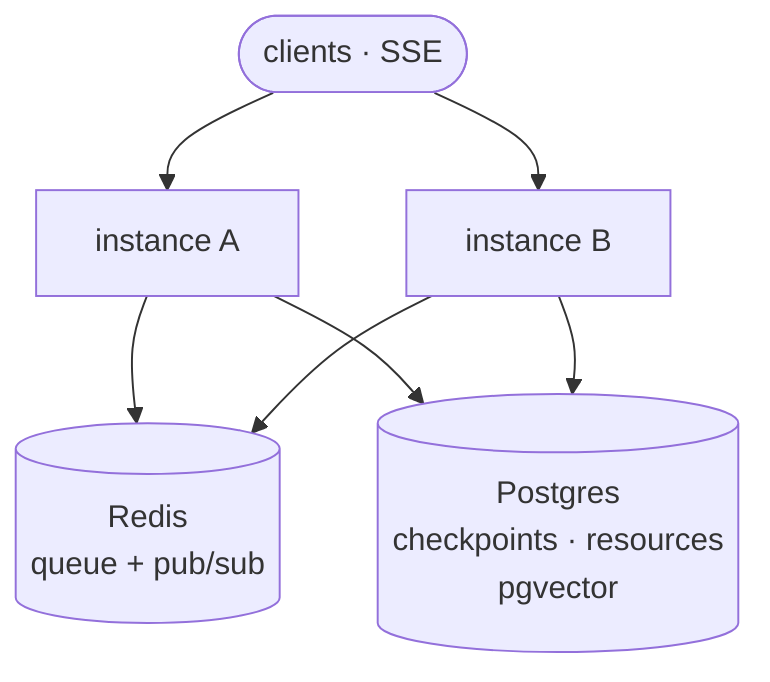

# Runs & Redis

This doc covers how skein-js executes runs and how it scales horizontally — modeled on
[aegra](https://github.com/aegra/aegra)'s worker + Redis architecture, adapted to Node.

> **Reuse note:** `@skein-js/redis` is the run **queue + pub/sub** — the piece LangGraph OSS
> does not provide (the open [`@langchain/langgraph-api`](https://github.com/langchain-ai/langgraphjs/tree/main/libs/langgraph-api)
> server runs runs in-process, in-memory). It is _not_ a checkpointer; for Redis-backed
> checkpoints use `@langchain/langgraph-checkpoint-redis`. See [reuse.md](https://github.com/skein-js/skein-js/blob/main/docs/reuse.md).

## Run modes

The [Agent Protocol](./agent-protocol.md) defines three ways to execute a graph:

| Mode           | Endpoint                                     | Behavior                                                   |
| -------------- | -------------------------------------------- | ---------------------------------------------------------- |
| **wait**       | `POST /runs/wait`, `GET /runs/{id}/wait`     | Run to completion, return final output.                    |
| **stream**     | `POST /runs/stream`, `GET /runs/{id}/stream` | [SSE](./streaming.md) as output is produced.               |
| **background** | `POST /threads/{id}/runs`                    | Enqueue; poll (`GET /runs/{id}`) or join its stream later. |

A **per-thread concurrency guard** prevents two active runs on the same thread (the protocol's
concurrency-control requirement). That is a different thing from
[run concurrency](#run-concurrency) below, which is how many runs on _different_ threads one
instance executes at once.

## Run engine

`@skein-js/agent-protocol` owns a run engine that:

1. Resolves the target graph via [`@skein-js/config`](./langgraph-cli-compat.md).
2. Persists a run row through [`SkeinStore`](./storage.md) (`pending → running → success/error`).
   A failed run also records _why_ on the row, so `GET /threads/{tid}/runs/{rid}` can still explain
   it afterwards — see [errors and logging](./errors-and-logging.md).
3. Invokes the graph (`invoke` for wait, `stream` for streaming), threading the LangGraph
   **checkpointer** so state/history persist and **interrupt/resume** (human-in-the-loop)
   works.
4. Publishes stream frames to subscribers (local bus or Redis pub/sub).

## Queue drivers

The engine talks to a small `RunQueue` / `RunEventBus` interface (`@skein-js/core`) with two
implementations. `RunQueue` is **processor-driven**: `enqueue(run)` adds a job and
`consume(process)` registers a worker that drains the queue — so the same run worker code drives
both drivers. Delivery is **at-least-once** (a crashed processor's run is redelivered); the worker
makes this safe by skipping any run already terminal in the store.

`enqueue` takes an optional `{ delayMs }` — the run-create
[`after_seconds`](./agent-protocol.md). The driver holds the run until it comes due, which is why a
delayed run costs nothing while it waits and cannot be picked up early. Both drivers dedupe a
re-enqueue of a run that is still waiting out its delay, so the cron scheduler's outbox sweep — which
re-enqueues anything it cannot prove reached the queue — can never cut a delay short or schedule the
same run twice. A delayed run is durable exactly as far as its driver is: see below.

### In-memory (dev)

- Single-process queue + event bus. No external services.
- Used by `skein dev` so nothing beyond Node is required locally.
- An `after_seconds` delay is a local timer, so it is lost on restart — like every other run already
  sitting in this queue, which is in-process too.

### `@skein-js/redis` (prod)

- **Job queue ([BullMQ](https://docs.bullmq.io))** — background runs are enqueued in Redis; worker
  processes across instances consume and execute them. BullMQ provides retries, backoff, and
  concurrency out of the box.
- **Crash recovery** — a stalled job (its worker died mid-run) is moved back to the queue by
  BullMQ's stalled-job check and retried, so runs survive restarts.
- **Delayed runs** — an `after_seconds` delay is handed to BullMQ's own delayed set, which lives in
  Redis and promotes the job when it comes due, so a scheduled run outlives the process that created it.
- **Cross-instance pub/sub** — run stream frames are published to a Redis Stream + channel so a
  client connected to instance B can join a run executing on instance A (see [streaming.md](./streaming.md)).
- **Cross-instance cancellation** — a `RunAbortChannel` over Redis pub/sub carries the _stop now_ signal
  to whichever instance is executing a run, so a cancel routed to the wrong replica still stops the
  graph. The cancel itself is durable in the run row before the message is published, so a dropped
  message costs promptness rather than correctness. See
  [deploy.md](./deploy.md#scaling-past-one-instance).

### What a frame costs

Publishing sits inside the graph's own loop — the engine awaits it per chunk — so at token
granularity its cost is paid per token. It is **one pipelined round trip**: `XADD` and `PUBLISH`
batched together, with the frame serialized once for both. The stream's TTL is refreshed every 256
frames and on close, rather than on every frame, since the window only has to outlive the run.

All in-flight subscribers share **one** pub/sub connection, with a `SUBSCRIBE` per run rather than a
connection per stream — an instance serving 500 SSE streams holds two Redis sockets, not 501.

Replay is paged (`XRANGE … COUNT`), and a reconnecting subscriber resumes from the last stream id it
read rather than re-reading the whole stream.

Two knobs bound what this costs:

| Variable                     | Default | Purpose                                                                                 |
| ---------------------------- | ------- | --------------------------------------------------------------------------------------- |
| `SKEIN_REDIS_STREAM_MAXLEN`  | 10000   | Approximate cap on a run's stream, in frames. `0` disables trimming (TTL only).         |
| `SKEIN_STREAM_BUFFER_FRAMES` | 512     | Frames one subscriber may queue before it is judged too far behind and its stream ends. |

`MAXLEN` exists because the 1-hour TTL bounds a stream in _time_ but not in size, and a chatty graph
can produce a very large one well inside an hour. Trimming is approximate (`~`), which lets Redis trim
whole nodes instead of walking the stream on every append.

A subscriber whose buffer overflows has its stream ended rather than being allowed to grow without
bound behind a reader that cannot drain it; the client reconnects with `Last-Event-ID` and replays from
the stream, which is what the stream is for.

This is the same shape aegra uses (Redis job queue + pub/sub, crash recovery, Postgres
checkpoints) — <https://github.com/aegra/aegra>.

## Run concurrency

How many **queued** (background) runs one instance executes at once. It defaults to **10**, matching
the LangGraph CLI's `--n-jobs-per-worker`, so a project moving off `langgraph dev` keeps its
throughput. Inline `wait`/`stream` runs never touch the queue and are unaffected.

Concurrency is the knob with the widest blast radius: it multiplies memory, Postgres connections, and
in-flight graph state at once. Size it together with `PG_POOL_MAX` — see
[performance.md](./performance.md#sizing), and note `skein start` warns at boot when the two disagree.

**One worker, N concurrent runs.** skein runs a _single_ background worker whose consumer executes up
to N runs at a time — which is why the startup banner says `Starting 1 worker, up to 10 concurrent
runs` rather than `langgraph dev`'s `Starting 10 workers` (it really does spawn 10 loops; we don't).
The observable behavior is the same.

> **Upgrading from ≤ 0.9.0?** This default changed: background runs used to execute strictly one at a
> time. Nothing about your code or config needs to change, but each instance now does up to 10 runs
> concurrently — so check that your Postgres pool has headroom (see
> [pool sizing](./deploy.md#connection-budget)), and note that background runs on one thread
> using `multitask_strategy: "enqueue"` no longer execute in strict enqueue order. Set
> `SKEIN_RUN_CONCURRENCY=1` (or `--concurrency 1`) to restore the previous behavior exactly.

Three ways to set it, highest precedence first:

| Surface        | How                                                                          |
| -------------- | ---------------------------------------------------------------------------- |
| CLI flag       | `skein dev --concurrency 4` / `skein start -n 4` (`--n-jobs-per-worker` too) |
| Environment    | `SKEIN_RUN_CONCURRENCY=4`, or the LangGraph-compatible `N_JOBS_PER_WORKER=4` |
| Adapter option | `createExpressServer({ deps, worker: { maxConcurrency: 4 } })`               |

An explicit value wins, but the environment is still validated — so a typo'd
`SKEIN_RUN_CONCURRENCY` fails loudly at boot instead of being silently ignored. The environment is
the path that reaches a container: add it to the `skein up` compose `environment:` block or your
PaaS config.

**Per-thread ordering is unaffected.** Two runs on the same thread are serialized by the engine's
execution lock at _every_ concurrency, so the per-thread guard above holds regardless.

### Head-of-line blocking

A run waiting on a busy thread's execution claim still occupies a slot. So N queued runs on the _same_
thread occupy N slots with N−1 merely waiting, and other threads wait behind them. This is a
**utilization** limit, not a correctness one — the claim keeps the runs correctly serialized either way.
Two things bound it:

- It needs an explicit opt-in. The default `multitask_strategy` is `"reject"`, and a pending run
  counts as active — so a second background run on a busy thread is rejected before it can queue.
  Only `multitask_strategy: "enqueue"` piles runs up on one thread.
- The worst case degrades to serial execution. No deadlock, no dropped run.

Relatedly, **ordering across background `"enqueue"` runs is not guaranteed above concurrency 1**:
several are dequeued at once and race for the thread's claim. This matches LangGraph at
`N_JOBS_PER_WORKER=10`, whose N worker loops have no cross-loop ordering guarantee either. If you
need strict FIFO across background runs on one thread, set concurrency to 1.

**Concurrency vs. replicas.** Raise concurrency when you have many independent threads and runs are
I/O-bound (model calls). Add instances when runs are CPU-bound, or when threads are long-lived and
serialized. Note each concurrent run holds a Postgres connection — see the pool-sizing note in
[deploy.md](./deploy.md#connection-budget) — and, on the Postgres driver, a second one for its
per-thread execution claim, held for the whole run.

## Deployment topology (`skein up`)

`skein up` brings this stack up via Docker Compose. Horizontal scaling is verified by
starting a run on instance A and joining its SSE stream from instance B through Redis (see
[testing.md](https://github.com/skein-js/skein-js/blob/main/docs/testing.md)).

To run the same topology on a hosted platform, the generated image is PaaS-friendly (binds the
injected `$PORT`, non-root, `/ok` health probe, graceful `SIGTERM`) — see
[deploy.md](./deploy.md) for what every platform needs, plus per-platform guides for Cloud Run,
Railway, Fly.io, Render, AWS, Kubernetes and a plain VPS.
