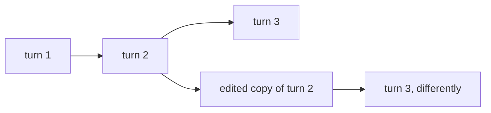

# Threads

A thread is one conversation: its message history, its graph state, and every checkpoint along the
way. If you're building a chat product, a thread is what a user would call "a chat" — and it's the
thing you address instead of tracking state yourself.

## Start a conversation

```ts
const thread = await client.threads.create();
await client.runs.wait(thread.thread_id, "agent", { input: { messages: [msg] } });
```

You rarely need more than that. Threads persist, so the next run on the same id picks up where the
last one left off — the graph sees the accumulated state without you passing any of it back.

## Address a conversation by your own key

Most apps already have an identity for the conversation — a phone number, a support ticket, an email
thread. You don't need to store skein's thread id alongside it. Pass your own id and make the create
a **get-or-create**:

```ts
const thread = await client.threads.create({
  threadId: ticketId,
  ifExists: "do_nothing", // returns the existing thread instead of a 409
});
```

Uniqueness is enforced in storage, so two instances racing the same id cannot both win — no lock of
your own required. The default is `ifExists: "raise"`, a 409 on a taken id.

The other half of the idiom is on run creation: `if_not_exists: "create"` lets a run bring the thread
into existence, so an inbound webhook can start a run in one call. See [runs.md](./runs.md).

## Read the state

```ts
const state = await client.threads.getState(threadId); // current values, next nodes, tasks
const history = await client.threads.getHistory(threadId, { limit: 10 }); // newest first
```

`getState` is what a UI hydrates from on load. `getHistory` walks the checkpoints backwards — page
with `before`, passing the last checkpoint you received.

**History is capped, and the cap matters.** You get at most 100 checkpoints when `limit` is omitted,
and a `limit` above 1000 is rejected — each element is a whole graph state, so a long thread's full
history is one of the largest responses skein can produce. `useStream` asks for 10, which is enough to
render the transcript (the newest checkpoint carries the whole message list) and only limits how far
back the branch/edit tree reaches.

## Time travel: re-run a turn a different way



The original branch is left intact — a fork is a new checkpoint, not a rewrite.

Fork from any past checkpoint and run forward from there, leaving the original branch intact. This is
what "edit and resubmit" in a chat UI is built on, and it's also the fastest way to debug what a node
actually saw.

```ts
// Run again from an earlier checkpoint
await client.runs.create(threadId, "agent", { input, checkpointId });
```

To change the state before re-running, write a new checkpoint that forks history first:

```ts
const forked = await client.threads.updateState(threadId, {
  values: { messages: editedMessages },
  checkpointId, // omit to fork from the tip
});
// The SDK returns a checkpoint config; the new id is on `configurable`.
const forkedId = forked.configurable?.["checkpoint_id"] as string;

// `input: null` + a checkpoint resumes the graph from that point rather than starting over.
await client.runs.create(threadId, "agent", { input: null, checkpointId: forkedId });
```

Things to know:

- **The fork target is server-validated.** A client cannot redirect a run to an arbitrary checkpoint
  through `config` — skein reads `checkpoint_id` only from the top-level field.
- **`updateState` 409s while a run is in flight** on that thread. Cancel or wait first.
- **It rides the checkpointer**, so forking costs no extra storage. If you want a whole independent
  copy instead, `client.threads.copy(threadId)` duplicates the thread and its history.
- The [console](./console.md) does all of this without code — open a checkpoint, edit, fork, run
  forward.

> [!WARNING]
> **Values you write go through the graph's reducers.** A channel that appends — a message list, say —
> will add what you write rather than replace it. This surprises everyone once. Use `asNode` to
> attribute the write to a node whose reducer does what you intend.

## Find threads

```ts
await client.threads.search({ metadata: { graph_id: "my_graph" }, status: "interrupted" });
```

skein stamps a run's `graph_id` and `assistant_id` onto its thread's metadata, so filtering by graph
is just a metadata match. The stamp reflects the thread's most recent run — a thread that has never
run carries no `graph_id`.

Status filters are how you build a "waiting for you" queue: `interrupted` threads are the ones
[paused for a human](./human-in-the-loop.md).

## Import an existing conversation

Migrating from another system, you usually want the history there without re-running the graph over
it. `POST /threads` accepts `supersteps` — updates written straight into the checkpoint history:

```ts
await client.threads.create({
  graphId: "agent", // required — a brand-new thread has no run to infer the graph from
  supersteps: [{ updates: [{ values: { messages: [past] }, asNode: "__start__" }] }],
});
```

Each superstep is one tick and becomes one checkpoint. Bounded at 100 supersteps of 100 updates.
Without `graphId` this is a 400 — and it's also what lets the seeded state be **read back**, since
`getState` falls back to `metadata.graph_id` for a thread that has never run.

## Clean up

| You want                                       | Call                                                 |
| ---------------------------------------------- | ---------------------------------------------------- |
| One thread gone, with its runs and checkpoints | `client.threads.delete(threadId)`                    |
| Many gone, by filter                           | `POST /threads/prune` with `strategy: "delete"`      |
| To keep the conversation but drop its history  | `POST /threads/prune` with `strategy: "keep_latest"` |
| Threads to expire on their own                 | `checkpointer.ttl` — see below                       |

`keep_latest` is the one people miss: it keeps each thread's current state and discards only the
checkpoint history behind it. That's usually where the bytes are, and losing it costs you time travel,
not the conversation.

### Expiring threads automatically

```json
{
  "checkpointer": {
    "ttl": { "default_ttl": 43200, "strategy": "delete", "sweep_interval_minutes": 60 }
  }
}
```

Durations are in **minutes**. `POST /threads` takes a per-thread `ttl` that overrides the default, and
an explicit `null` **pins** a thread so no TTL ever collects it.

**Expiry means "may be collected", not "gone".** An expired thread still reads normally until the
sweeper takes it — hiding it early would make a thread with an in-flight run vanish out from under
that run.

> [!WARNING]
> **Deleting a thread deletes any cron scheduled on it.** A thread-scoped [cron](./crons.md) on an
> expiring thread stops firing, silently. Pin such threads with `ttl: null`, or use a stateless cron,
> which owns no thread to lose.

LangGraph OSS drops `ttl` on the floor (it's a Platform feature there), so this is skein going past
what the open-source checkpointers do. Full reference: [storage.md](./storage.md#thread-ttl).

## Working example

[`triage-agent`](https://github.com/skein-js/skein-js/tree/main/examples/triage-agent) puts each issue
on its own thread, keyed by the issue id, and re-sweeps without duplicating any of them.

## See also

- [Runs](./runs.md) — starting work on a thread
- [Human-in-the-loop](./human-in-the-loop.md) — the `interrupted` status and resuming
- [The console](./console.md) — browsing threads, checkpoints and forks in a UI
- [Storage](./storage.md) — where threads and checkpoints actually live
- [Agent Protocol](./agent-protocol.md#threads) — every thread endpoint and field
