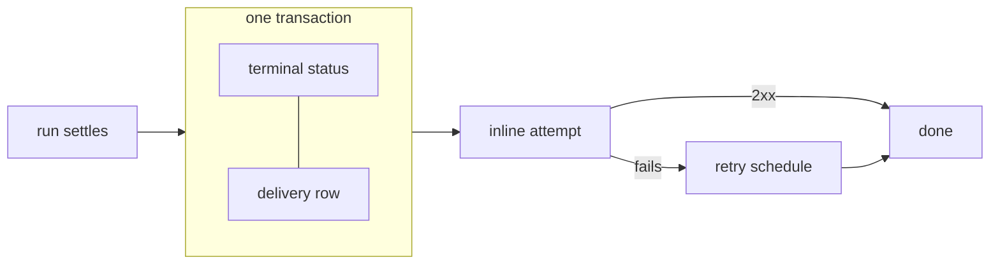

# Run-completion webhooks

Tell another service that a run finished, and have that news survive a receiver that was redeploying
when it happened. Pass a `webhook` URL on run creation and skein POSTs the settled run to it —
durably, with retries, optionally signed, and replayable by hand when it never lands.

## Quick start

```ts
await client.runs.create(threadId, "agent", {
  input,
  webhook: "https://example.com/hooks/run",
});
```

That is the whole opt-in. The field is LangGraph's, unchanged; everything below is delivery
semantics, not a different payload.

It works on every run-creation route that has a run to report on — background, `wait` and `stream`,
stateless, batch, and each firing of a [cron](./crons.md). It is not available on
[`POST /invoke/:graph_id`](./serving-a-single-graph.md), which has no run row.

## What the callback carries

The settled run, as a JSON body: the run's own fields (`run_id`, `thread_id`, `assistant_id`,
`metadata`, …) plus

| Field                           | What it is                                                                                |
| ------------------------------- | ----------------------------------------------------------------------------------------- |
| `status`                        | The run's terminal status — `success` · `error` · `timeout` · `interrupted` · `cancelled` |
| `values`                        | The run's final state                                                                     |
| `error`                         | The failure message, on a failed run only (a string, matching LangGraph)                  |
| `run_started_at`/`run_ended_at` | When the run ran                                                                          |
| `webhook_sent_at`               | When **this attempt** was sent — it changes between retries                               |

`status` is read from the delivery row rather than from the stored body, so a callback can never
disagree with the run you read back afterwards. A cancel that won the race is reported as the cancel.

**A run that never started executing sends no callback.** A run cancelled while still `pending`, or
one displaced by a [multitask strategy](./runs.md#multitask-what-happens-to-the-run-already-going)
before it began, has nothing to report — so do not treat "a run was created" as "a callback is
owed". Only a run that started does.

Every request also carries three headers, whenever the store records deliveries — which both bundled
drivers do:

| Header                | Use                                                         |
| --------------------- | ----------------------------------------------------------- |
| `X-Skein-Delivery-Id` | Stable across every retry — **this is your dedup key**      |
| `X-Skein-Attempt`     | Which attempt this is, counting the first inline one as `1` |
| `X-Skein-Signature`   | Present when a signing key is configured — see below        |

The one exception is a custom store that doesn't record deliveries — see
[the guarantee](#the-guarantee-why-a-callback-survives-a-crash) below.

## The guarantee: why a callback survives a crash



**The callback is recorded in the same transaction as the run's terminal status.** A crash between
"the run finished" and "someone was told" cannot lose it, because there is no instant where one is
committed and the other is not.

That guarantee comes from the store. It is not the retry policy, and it is not something you
configure — a run that carries a `webhook` owes a callback whether or not you have tuned anything.
skein attempts the first delivery inline, so a healthy receiver hears within milliseconds; only a
failure falls through to the retry schedule.

A [bring-your-own store](./storage.md) that does not implement the `deliveries` repo degrades to the
older best-effort path — one POST, failures logged and swallowed. Both bundled drivers implement it,
so this only bites a store you wrote yourself.

> [!WARNING]
> That fallback POST carries **no `X-Skein-Delivery-Id`, no `X-Skein-Attempt` and no
> `X-Skein-Signature`** — there is no delivery row for those to come from. A receiver that dedupes on
> the header, or rejects unsigned requests, will find nothing to work with. If you implement a custom
> store and want callbacks at all, implement the `deliveries` repo.

The body is **stored**, not re-rendered at send time. It has to be: a stateless `POST /runs` deletes
the thread the server made for it as soon as the run settles, so an hour later there is no run row
and no checkpoint left to render from — and that is exactly the "another service drives skein and
wants the answer back" case webhooks exist for.

Each POST is aborted after `SKEIN_WEBHOOK_TIMEOUT_MS` (default 5s), sized against the 8s shutdown
budget so a slow receiver cannot get the server killed mid-POST. Delivery happens after the thread's
execution lock is released, so a slow target never blocks other runs on that thread — which also
means two callbacks for one thread are not guaranteed to arrive in run order.

## At-least-once, and what your receiver owes

**Delivery is at-least-once, never exactly-once.** A POST that timed out _after_ your receiver
committed is indistinguishable from one that never arrived, so it is retried. Dedupe on
`X-Skein-Delivery-Id`, which is stable across every attempt.

Answer `2xx` only once the work is durably done. Answering early and then failing loses the callback
— the sender heard success and cleared the payload. A non-2xx is how you ask for a retry.

The API remains the source of truth for run state. A callback is a notification, not a ledger.

## Where the retries actually run

The durability of a callback is the same everywhere. What differs is whether a retry still _waiting_
survives a restart:

|                        | Retry schedule                                                               | A pending retry survives a restart?                                               |
| ---------------------- | ---------------------------------------------------------------------------- | --------------------------------------------------------------------------------- |
| **Postgres + Redis**   | BullMQ — delayed jobs, exponential backoff with jitter, stalled-job recovery | **Yes.** The schedule lives in Redis                                              |
| **Postgres, no Redis** | skein polls the outbox for rows that are due                                 | No — but the _delivery_ does. The row is committed, and the next boot picks it up |
| **Memory (dev)**       | The same poll, in-process                                                    | No, and neither does the delivery — nothing here is durable                       |

So: **run Redis in production.** skein warns at startup when your store is durable but your delivery
schedule is not. To exercise the real path locally, `skein dev --queue redis`.

A process killed at exactly the wrong moment can leave a committed delivery with no schedule attached.
Nothing is lost: a background sweep picks it up on its next pass. The practical consequence is that
such a callback arrives late rather than never — worth knowing if you alert on delivery latency.

The default is 12 attempts over roughly 34 minutes, which rides out a rolling deploy with room to
spare. Read that as a **time horizon, not a count** — the delays double, so dropping to 6 attempts is
~31 seconds, which does not survive one redeploy. Tune it under
[`skein.webhooks`](./langgraph-cli-compat.md#webhooks-skeinwebhooks).

## Verify a callback is really from you

Set `SKEIN_WEBHOOK_SECRET` and every callback carries `X-Skein-Signature` in Stripe's format —
`t=<unix seconds>,v1=<hex hmac-sha256>` over `"{t}.{raw body}"` — so a receiver can reuse
verification code it already has. skein ships the verifier too, from a package that installs with no
graph runtime, so a service whose only relationship with skein is _receiving_ callbacks can depend on
it for this and nothing else:

```ts
import { verifySkeinSignature } from "@skein-js/agent-protocol";

const result = verifySkeinSignature({
  header: req.headers["x-skein-signature"],
  body: rawBody, // the RAW bytes — see below
  secrets: [process.env.SKEIN_WEBHOOK_SECRET!],
});
if (!result.ok) return res.status(401).end();
```

It refuses with a `reason` of `missing`, `malformed`, `stale` or `mismatch`, compares digests in
constant time, and tries every secret you hand it.

Because the signature covers the timestamp, a **replay is detectable with no state on your side**: a
captured callback stops verifying once it is outside the tolerance window (5 minutes by default,
`toleranceSeconds`). The check is absolute, so a callback timestamped in the future is refused too.

### Three things receivers get wrong, in the order they get them wrong

1. **Verifying a re-serialized body.** `JSON.stringify(req.body)` does not reproduce what was signed
   — key order, whitespace and number formatting are not guaranteed to round-trip — so _every_
   genuine callback fails. In Express: `express.raw({ type: "application/json" })` on that route, or
   `express.json({ verify })`.
2. **Not deduping.** See at-least-once above. `X-Skein-Delivery-Id` is the key; `X-Skein-Attempt`
   tells you it is a retry.
3. **Answering 2xx before the work is durable.** The sender clears the payload on success. There is
   nothing left to resend.

A runnable receiver doing all three correctly — accepting a genuine callback, refusing a forged one
and a replayed one — is `src/webhook-receiver.ts` in
[`examples/express-basic`](https://github.com/skein-js/skein-js/tree/main/examples/express-basic)
(`pnpm webhook-receiver`).

### Rotating the key

Set `SKEIN_WEBHOOK_SECRET` to a comma-separated list, **new key first**: skein signs with the first
and receivers accept any they hold. Remove the old key only once every receiver has the new one — the
other order refuses every callback until they catch up.

> [!WARNING]
> If you inject your own `webhookDispatcher`, it must forward `attempt.headers` and send
> `attempt.body` verbatim, or callbacks go out unsigned while your config says they are signed. skein
> warns at startup when it sees both a signing key and a custom dispatcher.

## See what a callback did, and replay it

When a receiver was down for longer than the retry horizon, the delivery is `dead` — and still on
disk, which is what makes a by-hand replay possible.

| Method | Path                                                                 | Notes                               |
| ------ | -------------------------------------------------------------------- | ----------------------------------- |
| `GET`  | `/threads/{thread_id}/runs/{run_id}/deliveries`                      | `?status=` · `?limit=` · `?offset=` |
| `POST` | `/threads/{thread_id}/runs/{run_id}/deliveries/{delivery_id}/replay` | Makes it due immediately            |

```bash
curl "$API/threads/$TID/runs/$RID/deliveries?status=dead"
curl -X POST "$API/threads/$TID/runs/$RID/deliveries/$DID/replay"
```

Each row reports its `status` (`pending` · `delivering` · `delivered` · `dead`), `attempt`,
`last_error`, `next_attempt_at` and `payload_truncated`.

The list reports a boolean **`replayable`** rather than the payload itself. The payload is up to
256 KiB of the run's final state _per row_, and this is a list — returning it would make an
operator's "what failed?" the heaviest response the server can produce, for a field they did not ask
for. The question a replay turns on is only whether there is anything left to send. Read the state
from the run.

Replay makes a delivery due immediately. It **409s** on one that already succeeded (its payload was
cleared on delivery, so there is nothing to resend) and **404s** on a delivery id that does not belong
to the run in the path — so an id cannot be used to reach a callback on a run you have no access to.

Both endpoints sit in the `runs` route group, so `http.disable_runs` and your existing
`@auth.on.threads` handler already cover them; no new switch, no new resource.

There is **no console view for deliveries yet** — this is API-only today.

## What this stores, and for how long

A retry has to have something to send, so **the callback body is stored** — including the run's final
`values`. That is a new at-rest copy of whatever your graph produced, in the `deliveries` table, and
it is worth classifying deliberately if that state carries personal or regulated data:

- **On success it is cleared immediately**, so steady-state storage is in-flight deliveries, not every
  delivery ever made.
- **A `dead` delivery keeps it** for `retain_hours` (default 24) — that is what makes replay possible,
  and it means a callback that never landed leaves the run's final state on disk for a day.
- **It is not encrypted by skein.** Use your database's encryption at rest; the column is ordinary
  `jsonb`.
- **Deleting a thread or run does not erase its deliveries** — unlike idempotency records, which are
  erased explicitly. Lower `retain_hours` if that matters to you.

Payloads are capped at `max_payload_bytes` (default 256 KiB). Over the cap, `values` is replaced by a
truncation marker **inside the signed body** — so a receiver is told it is looking at a truncated
state rather than left to infer it — and the row's `payload_truncated` records it. Raise the cap, or
read the state back from the API using the `run_id` in the callback.

skein **redacts the webhook URL's path in logs**, keeping only the scheme and host: for Slack, Discord
and Teams the path _is_ the credential, and a failing delivery would otherwise write it into your log
sink on every attempt.

## Accepting webhook URLs from untrusted callers

`webhook` is a caller-supplied URL, so it is a server-side request to a target they chose — and
retrying it turns a one-shot SSRF probe into a repeated one. Set
[`skein.webhooks.allowed_hosts`](./langgraph-cli-compat.md#webhooks-skeinwebhooks) if you accept run
creates from clients you do not control. It is off by default so that upgrading cannot start dropping
your own callbacks; a refused host is recorded `dead` with the reason rather than silently skipped.

Set `require_https: true` if callbacks leave your network. Plaintext is permitted by default (an
internal receiver is legitimate), but retries mean the body crosses the wire up to `max_attempts`
times rather than once — a dozen exposures rather than one.

## Configuration

Every knob — `retries.max_attempts`, `retries.initial_delay_ms`, `secret`, `max_payload_bytes`,
`retain_hours`, `allowed_hosts`, `require_https` — is documented once, with its default and its
reasoning, in [`skein.webhooks`](./langgraph-cli-compat.md#webhooks-skeinwebhooks).

Two environment variables sit outside that block: `SKEIN_WEBHOOK_SECRET` (which takes precedence over
a `secret` in the config file) and `SKEIN_WEBHOOK_TIMEOUT_MS`.

> [!WARNING]
> skein does **not** expand `${VAR}` anywhere in `langgraph.json`. `"secret": "${SKEIN_WEBHOOK_SECRET}"`
> signs every callback with that literal 23-character string. Use the environment variable.

## See also

- [Runs](./runs.md) — the run-creation fields a callback reports on
- [Errors & logging](./errors-and-logging.md) — what a failed run puts in the callback body
- [Agent Protocol](./agent-protocol.md) — the full endpoint inventory
- [Background jobs](./background-jobs.md) — the fire-and-forget shape webhooks were built for
